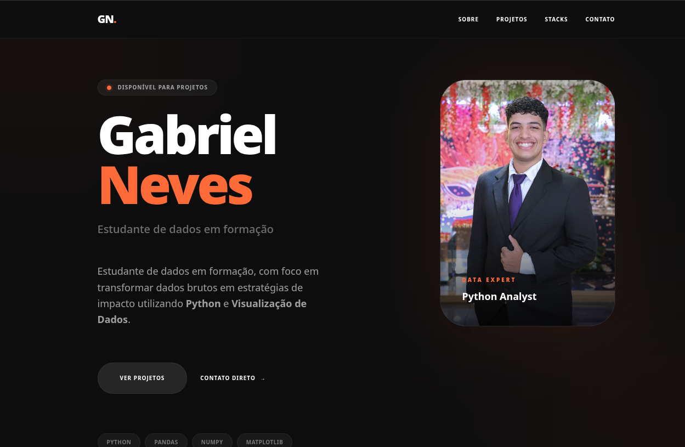
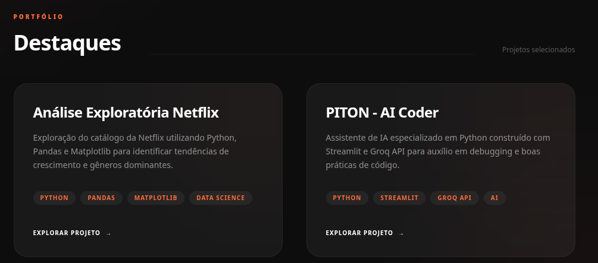

# 🚀 Portfólio Premium - Gabriel Neves

Bem-vindo ao meu portfólio pessoal! Este projeto foi desenvolvido para ser uma vitrine imersiva e profissional das minhas habilidades em **Ciência de Dados**, **Python** e **Inteligência Artificial**.



## ✨ Sobre o Projeto

Este portfólio não é apenas uma lista de links, mas uma experiência visual projetada para destacar a clareza e a profundidade das minhas análises. Utilizando uma estética **Dark Premium**, o site foca no minimalismo e na interatividade para prender a atenção do visitante.

### Diferenciais:
- **Design Imersivo**: Uso de glassmorphism, efeitos de brilho (glow) e transições suaves.
- **Foco em Dados**: Seções dedicadas a projetos reais de análise e ferramentas de IA.
- **Navegação Fluida**: Sistema de links inteligentes com feedbacks visuais em laranja.

---

## 🛠️ Tecnologias Utilizadas

- **Frontend**: Next.js (App Router), React 19, Tailwind CSS 4.
- **Estilização**: Glassmorphism, Gradientes Mesh, Animações CSS3.
- **Backend**: API Routes em memória (pronto para integração com DB).
- **Linguagem**: TypeScript para maior robustez e tipagem.

---

## 📊 Projetos em Destaque



### 1. 🎬 Análise Exploratória Netflix
Uma investigação profunda no catálogo da gigante do streaming. Utilizando **Python**, **Pandas** e **Matplotlib**, identifiquei padrões de crescimento, gêneros dominantes e a evolução do conteúdo global da plataforma.

### 2. 🐍 PITON - AI Coder
Um assistente de IA especializado em programação Python. Desenvolvido com **Streamlit** e integrando a **API Groq**, o PITON ajuda desenvolvedores com debugging, boas práticas PEP 8 e documentação rápida.

---

## 🚀 Como Executar Localmente

1. **Clone o repositório**:
   ```bash
   git clone git@github.com:Aiel-rgb/Portifolio_novo.git
   cd portfolio-gabriel
   ```

2. **Instale as dependências**:
   ```bash
   npm install
   ```

3. **Inicie o servidor de desenvolvimento**:
   ```bash
   npm run dev
   ```

4. **Acesse**: [https://portifoliodados.vercel.app/](https://portifoliodados.vercel.app/)

---

## 👨‍💻 Autor

**Gabriel Neves**  
*Analista de Dados em formação*  

---

> *"Transformando dados brutos em inteligência estratégica."*
